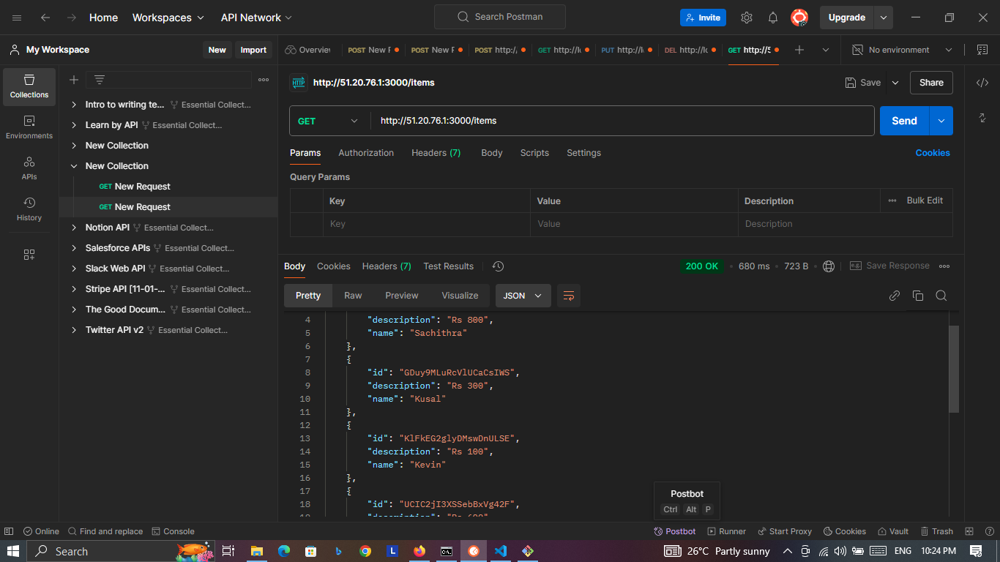
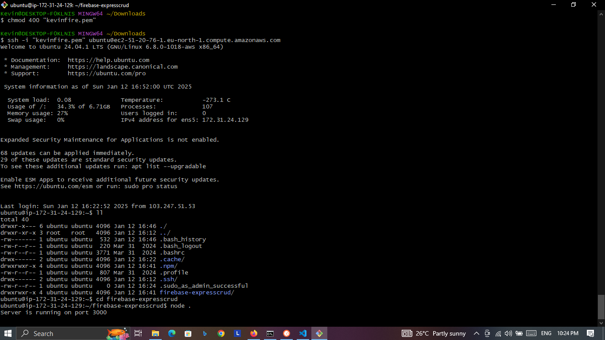

Developed a robust RESTful API using Node.js and Express.js, integrated with Firebase as the real-time database. The API facilitates CRUD operations (Create, Read, Update, Delete) for efficient data management. Hosted the project on an AWS EC2 instance, showcasing my skills in:

    Backend Development: Built a scalable and maintainable API with industry-standard practices.
    Cloud Integration: Leveraged Firebase for real-time data synchronization and storage.
    AWS Hosting: Deployed the API on an EC2 instance, ensuring reliability and scalability.

This project highlights my expertise in backend development, API design, and cloud-based deployment.
!!Postman Check hosted in WAS ECS2 Instance Database Firebase

!! Git Bash Ubuntu hypervisor

